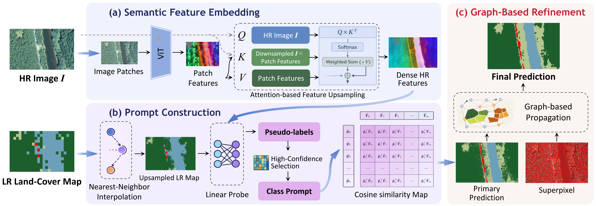

# MapSR: Prompt-Driven Land Cover Map Super-Resolution via Vision Foundation Models

High-spatial-resolution (HR) land-cover mapping is often constrained by the high cost of dense HR annotations. We revisit this problem from the perspective of map super-resolution (MapSR), which enhances coarse low-spatial-resolution (LR) land-cover products into HR maps at the resolution of the input imagery. MapSR is a prompt-driven framework that decouples supervision from model training. It uses LR labels once to extract class prompts from frozen vision foundation model features through a lightweight linear probe, after which HR mapping proceeds via training-free metric inference and graph-based prediction refinement.



## Environment Setup

Please create a conda environment using Python 3.10 and PyTorch 2.0.1.

```bash
# Create and activate the conda environment
conda create -n mapsr python=3.10 -y
conda activate mapsr

# Install PyTorch (CUDA 11.8 version as an example, adjust if needed)
pip install torch==2.0.1 torchvision==0.15.2 torchaudio==2.0.2 --index-url https://download.pytorch.org/whl/cu118

# Install other required dependencies
pip install -r requirements.txt

# Install mmcv in Python-only mode (bypassing CUDA compilation)
MMCV_WITH_OPS=0 pip install mmcv==1.6.0 --no-build-isolation

# Fix numpy and opencv versions to avoid compatibility issues
pip install numpy==1.26.4 opencv-python==4.11.0.86
```

## Prepare Weights

The model relies on our trained weights and the pre-trained DINOv2 weights.

1. Download our pre-trained model weights from [HuggingFace](https://huggingface.co/rikirikirikiriki/DinoV2_LinearProb/tree/main) or [Baidu Pan](https://pan.baidu.com/s/1eMn8fv9tvM0MNm2E0QBWpw) (Extraction code: `qhjx`).
2. Place the downloaded pre-trained model weights into the following directory:
   ```text
   networks/pre-train_model/[pre-trained model weights].pth
   ```

*(Note: The HuggingFace DINOv2 base model will be downloaded automatically on the first run).*

## Prepare Dataset

The dataloader reads imagery paths from CSV files. 

1. Download the testing dataset from [HuggingFace](https://huggingface.co/datasets/rikirikirikiriki/ChesapeakeBay/tree/main) or [Baidu Pan](https://pan.baidu.com/s/1wBpycuYMR20Y9Ja10emqpw) (Extraction code: `peqd`).
2. *(Optional)* The complete ChesapeakeBay dataset can be downloaded from [LILA BC](https://lila.science/datasets/chesapeakelandcover).
3. Place the dataset in the `dataset/` directory.
4. Ensure the `.tif` image paths written inside your CSV files (located in `dataset/CSV_list/`) correctly point to where you stored the imagery on your local machine.

## Run Inference & Refinement

```bash
python main.py
```

## Calculate Metrics (mIoU)

```bash
python calc_metric.py
```

